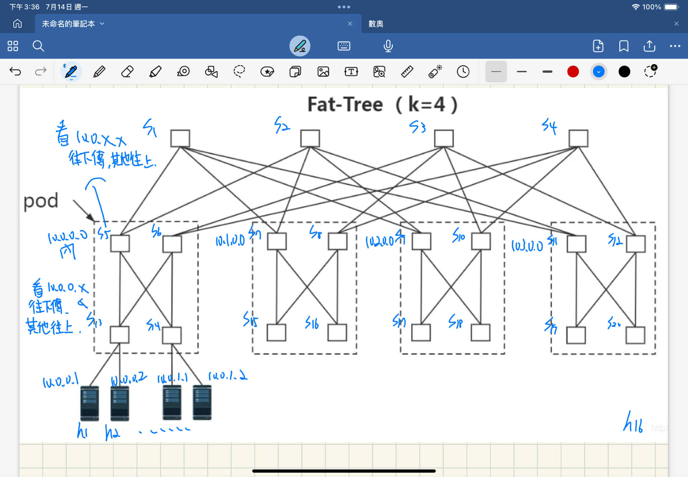

Test Transmission

## Test Content
- Topology: **fat-tree (k=4)**
- Scenario: multiple hosts transmitting simultaneously
- Observation: path overlap causes congestion and lowers sender throughput
- Comparison:
  - **Unused-Path-First** algorithm
  - **BFS** (tends to overlap paths)

## Goal
- Dynamically change paths and observe results
- Compare performance differences between algorithms

## Five TCP Option Fields
- total_time  
- elapsed_time  
- total_size  
- sent_size  
- estimated_remaining_time  

## Work in Progress
- Using the 5 fields to design a more complete path-changing algorithm for different transmission scenarios

## Execution Order
1. Run `controller.py` (controller side)  
2. Run `receive.py` (on the receiver host)  
3. Run `send.py` (on the sender host)  
> Topology configuration: `topology.json`

## Topology

## Reference
- https://github.com/ytli666/flow-info-kernel

