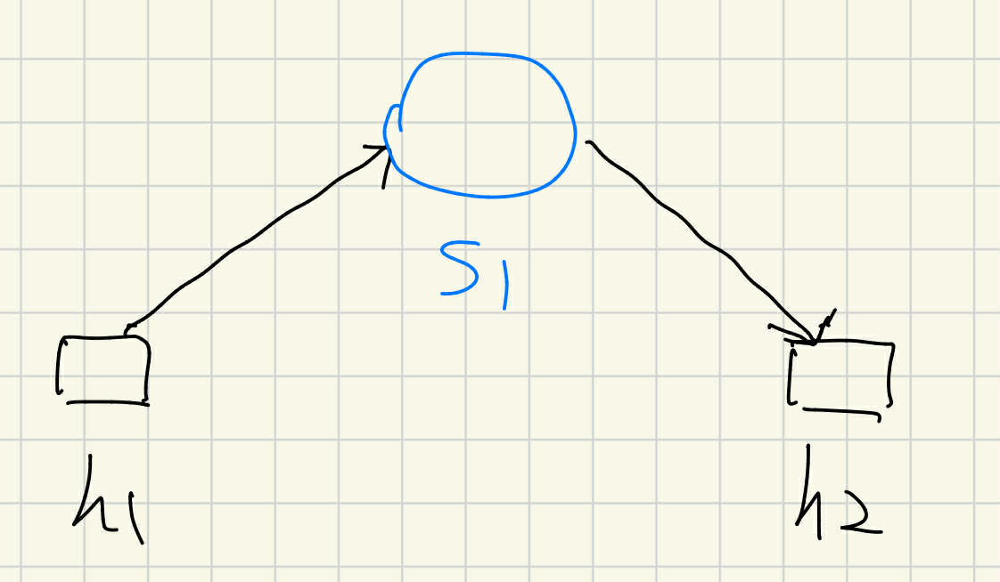
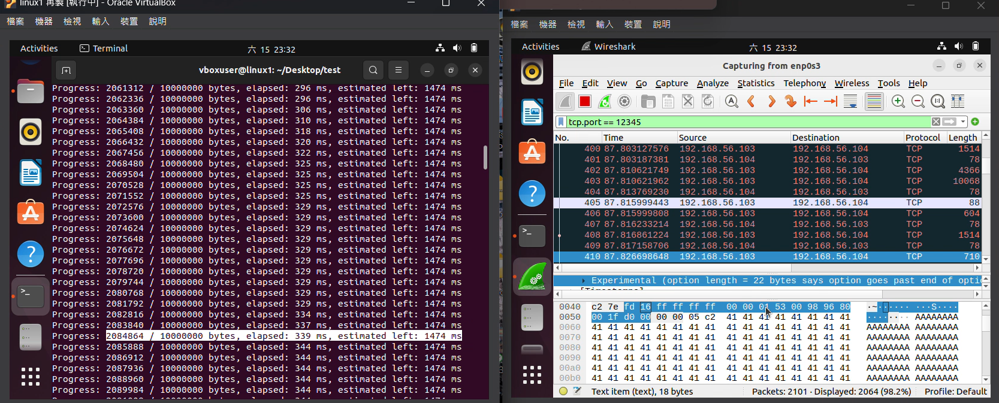
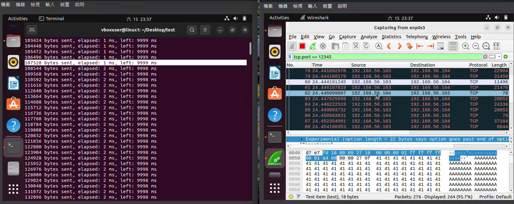

# Testing the Customized Linux Kernel Functionality

## Topology
The testbed consists of **two hosts connected to one switch**.



- On **h1**: run `send.py`
- On **h2**: run `receive.py`

## P4 Registers and Observation
In the P4 program, the five tuples are declared as registers.  
After the transmission is complete, the values of these five registers are printed to observe whether they increase or decrease as expected.  
Wireshark is also used to verify whether the packets correctly carry the five-tuple values.

---

## File Transfer Test

In Wireshark, the following TCP option is observed:



```
fd 16 ff ff ff ff 00 00 01 53 00 98 96 80 00 1f d0 00 00 00 05 c2
```

This corresponds to our custom TCP option:

- `fd` → **TCP Option Kind (253)**
- `16` → **TCP Option Length (22)**  
  (5 tuples × 4 bytes each = 20 bytes, plus 1 byte for Kind and 1 byte for Length = 22 bytes total)

Values:
- `ff ff ff ff` → **total_time** (unused in file transfer, marked as `ff ff ff ff`)
- `00 00 01 53` → **elapsed_time** = 339 ms
- `00 98 96 80` → **total_size** = 10,000,000 bytes
- `00 1f d0 00` → **sent_size** = 2,084,864 / 10,000,000 bytes (sent/total)
- `00 00 05 c2` → **estimated_remaining_time** = 1474 ms

---

## Streaming Test



In streaming mode:
- **total_time** is set to `00 00 27 10` (10,000 ms = 10 seconds of streaming).
- **total_size** is set to `ff ff ff ff` (unused in streaming).
- The remaining fields correspond to the same semantics as in the file transfer case.

---

## Detailed Test Videos
- **File Transfer:** [file.mp4](file.mp4)  
- **Streaming:** [streaming.mp4](streaming.mp4)
